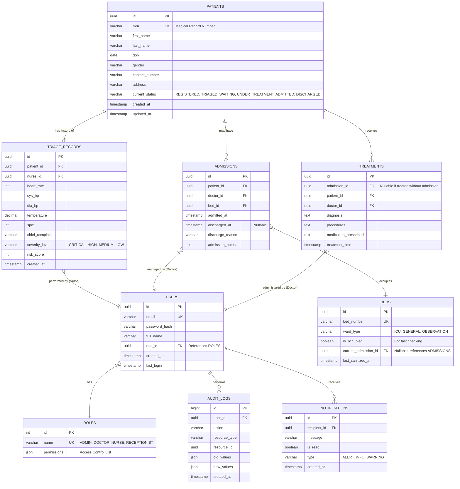

# Entity Relationship Diagram (ERD)

```mermaid
erDiagram

    %% User Management
    USERS {
        uuid id PK
        varchar email UK
        varchar password_hash
        varchar full_name
        uuid role_id FK "References ROLES"
        timestamp created_at
        timestamp last_login
    }

    ROLES {
        int id PK
        varchar name UK "ADMIN, DOCTOR, NURSE, RECEPTIONIST"
        json permissions "Access Control List"
    }

    %% Patient Management
    PATIENTS {
        uuid id PK
        varchar mrn UK "Medical Record Number"
        varchar first_name
        varchar last_name
        date dob
        varchar gender
        varchar contact_number
        varchar address
        varchar current_status "REGISTERED, TRIAGED, WAITING, UNDER_TREATMENT, ADMITTED, DISCHARGED"
        timestamp created_at
        timestamp updated_at
    }

    TRIAGE_RECORDS {
        uuid id PK
        uuid patient_id FK
        uuid nurse_id FK
        int heart_rate
        int sys_bp
        int dia_bp
        decimal temperature
        int spo2
        varchar chief_complaint
        varchar severity_level "CRITICAL, HIGH, MEDIUM, LOW"
        int risk_score
        timestamp created_at
    }

    %% Beds & Admissions
    BEDS {
        uuid id PK
        varchar bed_number UK
        varchar ward_type "ICU, GENERAL, OBSERVATION"
        boolean is_occupied "For fast checking"
        uuid current_admission_id FK "Nullable, references ADMISSIONS"
        timestamp last_sanitized_at
    }

    ADMISSIONS {
        uuid id PK
        uuid patient_id FK
        uuid doctor_id FK
        uuid bed_id FK
        timestamp admitted_at
        timestamp discharged_at "Nullable"
        varchar discharge_reason
        text admission_notes
    }

    TREATMENTS {
        uuid id PK
        uuid admission_id FK "Nullable if treated without admission"
        uuid patient_id FK
        uuid doctor_id FK
        text diagnosis
        text procedures
        text medication_prescribed
        timestamp treatment_time
    }

    %% Logs & Notifications
    AUDIT_LOGS {
        bigint id PK
        uuid user_id FK
        varchar action
        varchar resource_type
        uuid resource_id
        json old_values
        json new_values
        timestamp created_at
    }
    
    NOTIFICATIONS {
        uuid id PK
        uuid recipient_id FK
        varchar message
        boolean is_read
        varchar type "ALERT, INFO, WARNING"
        timestamp created_at
    }

    %% Relationships
    USERS }|--|| ROLES : has
    PATIENTS ||--|{ TRIAGE_RECORDS : "has history of"
    TRIAGE_RECORDS }|--|| USERS : "performed by (Nurse)"
    
    PATIENTS ||--o{ ADMISSIONS : "may have"
    ADMISSIONS }|--|| BEDS : "occupies"
    ADMISSIONS }|--|| USERS : "managed by (Doctor)"
    
    PATIENTS ||--o{ TREATMENTS : "receives"
    TREATMENTS }|--|| USERS : "administered by (Doctor)"
    
    USERS ||--o{ AUDIT_LOGS : "performs"
    USERS ||--o{ NOTIFICATIONS : "receives"
    
```
