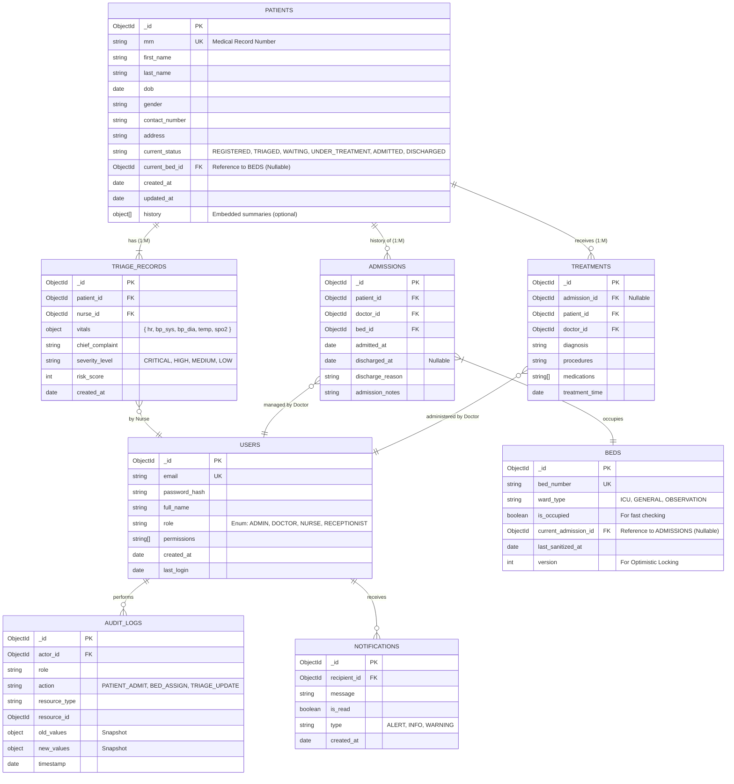

# MongoDB Collection Design

```mermaid
erDiagram

    %% User Collection
    USERS {
        ObjectId _id PK
        string email UK
        string password_hash
        string full_name
        string role "Enum: ADMIN, DOCTOR, NURSE, RECEPTIONIST"
        string[] permissions
        date created_at
        date last_login
    }

    %% Patient Collection - Core Entity
    PATIENTS {
        ObjectId _id PK
        string mrn UK "Medical Record Number"
        string first_name
        string last_name
        date dob
        string gender
        string contact_number
        string address
        string current_status "REGISTERED, TRIAGED, WAITING, UNDER_TREATMENT, ADMITTED, DISCHARGED"
        ObjectId current_bed_id FK "Reference to BEDS (Nullable)"
        date created_at
        date updated_at
        object[] history "Embedded summaries (optional)"
    }

    %% Triage Records - High Volume (Referenced)
    TRIAGE_RECORDS {
        ObjectId _id PK
        ObjectId patient_id FK
        ObjectId nurse_id FK
        object vitals "{ hr, bp_sys, bp_dia, temp, spo2 }"
        string chief_complaint
        string severity_level "CRITICAL, HIGH, MEDIUM, LOW"
        int risk_score
        date created_at
    }

    %% Beds - Resource Management
    BEDS {
        ObjectId _id PK
        string bed_number UK
        string ward_type "ICU, GENERAL, OBSERVATION"
        boolean is_occupied "For fast checking"
        ObjectId current_admission_id FK "Reference to ADMISSIONS (Nullable)"
        date last_sanitized_at
        int version "For Optimistic Locking"
    }

    %% Admissions - Tracks Bed Usage history
    ADMISSIONS {
        ObjectId _id PK
        ObjectId patient_id FK
        ObjectId doctor_id FK
        ObjectId bed_id FK
        date admitted_at
        date discharged_at "Nullable"
        string discharge_reason
        string admission_notes
    }

    %% Treatments - Clinical Notes (Can be Embedded or Referenced)
    TREATMENTS {
        ObjectId _id PK
        ObjectId admission_id FK "Nullable"
        ObjectId patient_id FK
        ObjectId doctor_id FK
        string diagnosis
        string procedures
        string[] medications
        date treatment_time
    }

    %% Audit Logs - Immutable, Append-Only
    AUDIT_LOGS {
        ObjectId _id PK
        ObjectId actor_id FK
        string role
        string action "PATIENT_ADMIT, BED_ASSIGN, TRIAGE_UPDATE"
        string resource_type
        ObjectId resource_id
        object old_values "Snapshot"
        object new_values "Snapshot"
        date timestamp
    }
    
    %% Notifications - Event System
    NOTIFICATIONS {
        ObjectId _id PK
        ObjectId recipient_id FK
        string message
        boolean is_read
        string type "ALERT, INFO, WARNING"
        date created_at
    }

    %% Relationships (Logical)
    USERS ||--o{ AUDIT_LOGS : "performs"
    USERS ||--o{ NOTIFICATIONS : "receives"
    
    PATIENTS ||--|{ TRIAGE_RECORDS : "has (1:M)"
    TRIAGE_RECORDS }o--|| USERS : "by Nurse"
    
    PATIENTS ||--o{ ADMISSIONS : "history of (1:M)"
    ADMISSIONS }|--|| BEDS : "occupies"
    ADMISSIONS }o--|| USERS : "managed by Doctor"
    
    PATIENTS ||--o{ TREATMENTS : "receives (1:M)"
    TREATMENTS }o--|| USERS : "administered by Doctor"
```
