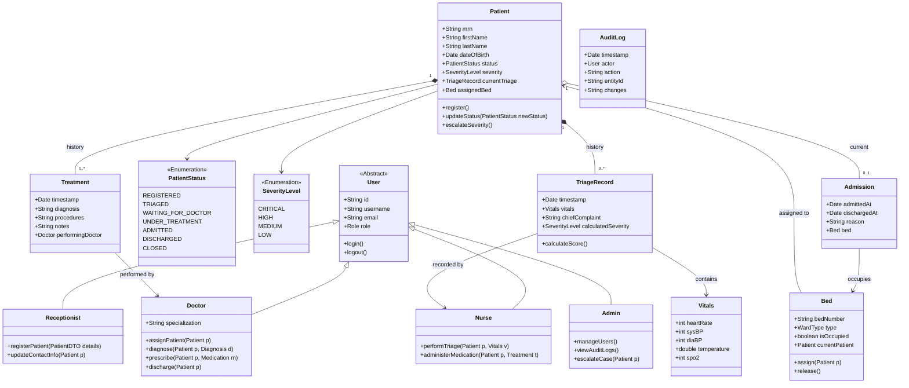

# Domain Class Diagram

```mermaid
classDiagram
    %% Abstract User
    class User {
        <<Abstract>>
        +String id
        +String username
        +String email
        +Role role
        +login()
        +logout()
    }

    class Doctor {
        +String specialization
        +assignPatient(Patient p)
        +diagnose(Patient p, Diagnosis d)
        +prescribe(Patient p, Medication m)
        +discharge(Patient p)
    }

    class Nurse {
        +performTriage(Patient p, Vitals v)
        +administerMedication(Patient p, Treatment t)
    }

    class Receptionist {
        +registerPatient(PatientDTO details)
        +updateContactInfo(Patient p)
    }

    class Admin {
        +manageUsers()
        +viewAuditLogs()
        +escalateCase(Patient p)
    }

    %% Patient Entity
    class Patient {
        +String mrn
        +String firstName
        +String lastName
        +Date dateOfBirth
        +PatientStatus status
        +SeverityLevel severity
        +TriageRecord currentTriage
        +Bed assignedBed
        +register()
        +updateStatus(PatientStatus newStatus)
        +escalateSeverity()
    }

    %% Value Objects & Enums
    class PatientStatus {
        <<Enumeration>>
        REGISTERED
        TRIAGED
        WAITING_FOR_DOCTOR
        UNDER_TREATMENT
        ADMITTED
        DISCHARGED
        CLOSED
    }

    class SeverityLevel {
        <<Enumeration>>
        CRITICAL
        HIGH
        MEDIUM
        LOW
    }

    class Vitals {
        +int heartRate
        +int sysBP
        +int diaBP
        +double temperature
        +int spo2
    }

    %% Clinical Records
    class TriageRecord {
        +Date timestamp
        +Vitals vitals
        +String chiefComplaint
        +SeverityLevel calculatedSeverity
        +calculateScore()
    }

    class Treatment {
        +Date timestamp
        +String diagnosis
        +String procedures
        +String notes
        +Doctor performingDoctor
    }

    class Admission {
        +Date admittedAt
        +Date dischargedAt
        +String reason
        +Bed bed
    }

    %% Resources
    class Bed {
        +String bedNumber
        +WardType type
        +boolean isOccupied
        +Patient currentPatient
        +assign(Patient p)
        +release()
    }

    %% System
    class AuditLog {
        +Date timestamp
        +User actor
        +String action
        +String entityId
        +String changes
    }
    
    %% Relationships
    User <|-- Doctor
    User <|-- Nurse
    User <|-- Receptionist
    User <|-- Admin

    Patient "1" *-- "0..*" TriageRecord : history
    Patient "1" *-- "0..*" Treatment : history
    Patient "1" o-- "0..1" Admission : current
    Patient --> PatientStatus
    Patient --> SeverityLevel
    
    Admission --> Bed : occupies
    Bed --> Patient : assigned to
    
    Treatment --> Doctor : performed by
    TriageRecord --> Vitals : contains
    TriageRecord --> Nurse : recorded by
```
