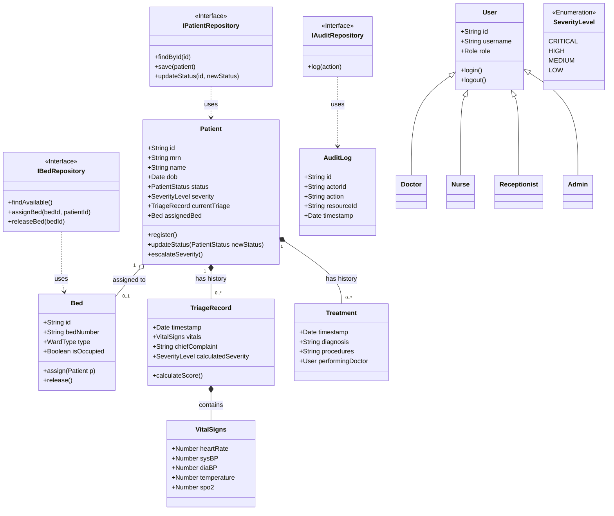

# Domain Class Diagram (Node.js + Clean Architecture)

```mermaid
classDiagram
    %% Abstract Repository Interface
    class IPatientRepository {
        <<Interface>>
        +findById(id)
        +save(patient)
        +updateStatus(id, newStatus)
    }

    class IBedRepository {
        <<Interface>>
        +findAvailable()
        +assignBed(bedId, patientId)
        +releaseBed(bedId)
    }

    class IAuditRepository {
        <<Interface>>
        +log(action)
    }

    %% Domain Entities
    class Patient {
        +String id
        +String mrn
        +String name
        +Date dob
        +PatientStatus status
        +SeverityLevel severity
        +TriageRecord currentTriage
        +Bed assignedBed
        +register()
        +updateStatus(PatientStatus newStatus)
        +escalateSeverity()
    }

    class User {
        +String id
        +String username
        +Role role
        +login()
        +logout()
    }

    class Bed {
        +String id
        +String bedNumber
        +WardType type
        +Boolean isOccupied
        +assign(Patient p)
        +release()
    }

    class TriageRecord {
        +Date timestamp
        +VitalSigns vitals
        +String chiefComplaint
        +SeverityLevel calculatedSeverity
        +calculateScore()
    }

    class Treatment {
        +Date timestamp
        +String diagnosis
        +String procedures
        +User performingDoctor
    }

    class AuditLog {
        +String id
        +String actorId
        +String action
        +String resourceId
        +Date timestamp
    }

    %% Value Objects
    class VitalSigns {
        +Number heartRate
        +Number sysBP
        +Number diaBP
        +Number temperature
        +Number spo2
    }

    class SeverityLevel {
        <<Enumeration>>
        CRITICAL
        HIGH
        MEDIUM
        LOW
    }

    %% Relationships
    User <|-- Doctor
    User <|-- Nurse
    User <|-- Receptionist
    User <|-- Admin

    Patient "1" *-- "0..*" TriageRecord : has history
    Patient "1" *-- "0..*" Treatment : has history
    Patient "1" o-- "0..1" Bed : assigned to
    
    TriageRecord *-- VitalSigns : contains

    IPatientRepository ..> Patient : uses
    IBedRepository ..> Bed : uses
    IAuditRepository ..> AuditLog : uses
```
