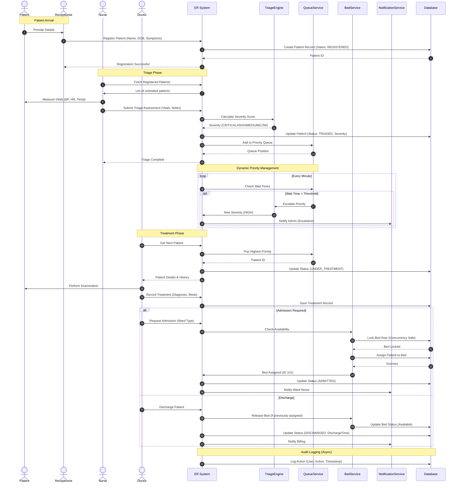

# Patient ER Workflow Sequence Diagram

```mermaid
sequenceDiagram
    autonumber
    actor Patient
    actor Receptionist
    actor Nurse
    actor Doctor
    participant System as ER System
    participant TriageEngine
    participant QueueService
    participant BedService
    participant NotificationService
    participant Database

    Note over Patient, Receptionist: Patient Arrival

    Patient->>Receptionist: Provide Details
    Receptionist->>System: Register Patient (Name, DOB, Symptoms)
    System->>Database: Create Patient Record (Status: REGISTERED)
    Database-->>System: Patient ID
    System-->>Receptionist: Registration Successful

    Note over Nurse, System: Triage Phase

    Nurse->>System: Fetch Registered Patients
    System->>Nurse: List of untreated patients
    Nurse->>Patient: Measure Vitals (BP, HR, Temp)
    Nurse->>System: Submit Triage Assessment (Vitals, Notes)
    System->>TriageEngine: Calculate Severity Score
    TriageEngine-->>System: Severity (CRITICAL/HIGH/MEDIUM/LOW)
    System->>Database: Update Patient (Status: TRIAGED, Severity)
    System->>QueueService: Add to Priority Queue
    QueueService-->>System: Queue Position
    System-->>Nurse: Triage Complete

    Note over System, QueueService: Dynamic Priority Management

    loop Every Minute
        System->>QueueService: Check Wait Times
        opt Wait Time > Threshold
            QueueService->>TriageEngine: Escalate Priority
            TriageEngine->>System: New Severity (HIGH)
            System->>NotificationService: Notify Admin (Escalation)
        end
    end

    Note over Doctor, System: Treatment Phase

    Doctor->>System: Get Next Patient
    System->>QueueService: Pop Highest Priority
    QueueService-->>System: Patient ID
    System->>Database: Update Status (UNDER_TREATMENT)
    System-->>Doctor: Patient Details & History
    
    Doctor->>Patient: Perform Examination
    Doctor->>System: Record Treatment (Diagnosis, Meds)
    System->>Database: Save Treatment Record

    alt Admission Required
        Doctor->>System: Request Admission (Ward Type)
        System->>BedService: Check Availability
        BedService->>Database: Lock Bed Row (Concurrency Safe)
        Database-->>BedService: Bed Locked
        BedService->>Database: Assign Patient to Bed
        Database-->>BedService: Success
        BedService->>System: Bed Assigned (ID 101)
        System->>Database: Update Status (ADMITTED)
        System->>NotificationService: Notify Ward Nurse
    else Discharge
        Doctor->>System: Discharge Patient
        System->>BedService: Release Bed (if previously assigned)
        BedService->>Database: Update Bed Status (Available)
        System->>Database: Update Status (DISCHARGED, DischargeTime)
        System->>NotificationService: Notify Billing
    end

    Note over System, Database: Audit Logging (Async)
    System->>Database: Log Action (User, Action, Timestamp)
```
