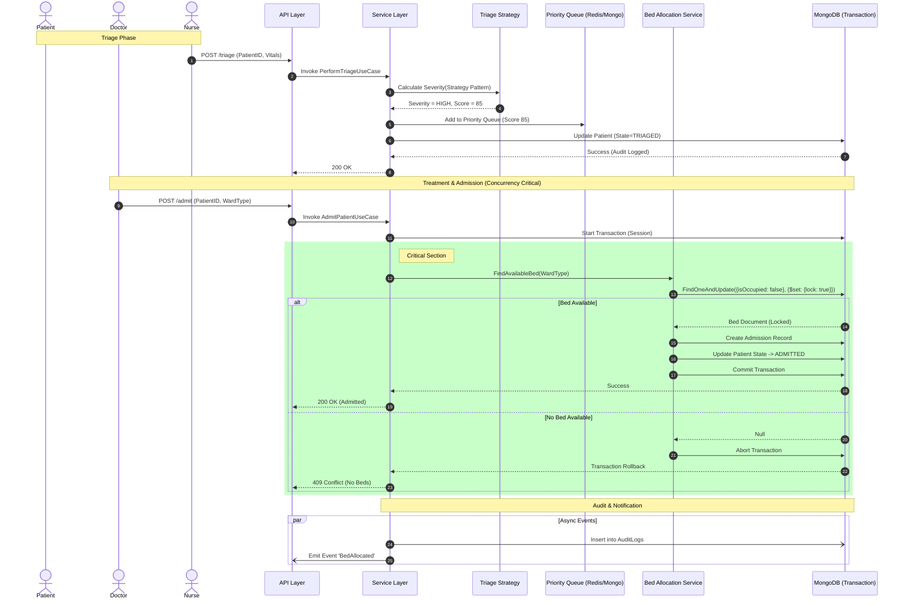

# Patient ER Workflow Sequence Diagram (Node.js + Concurrency)

```mermaid
sequenceDiagram
    autonumber
    actor Patient
    actor Doctor
    actor Nurse
    participant API as API Layer
    participant UseCase as Service Layer
    participant TriageDomain as Triage Strategy
    participant Queue as Priority Queue (Redis/Mongo)
    participant BedService as Bed Allocation Service
    participant Mongo as MongoDB (Transaction)

    Note over Patient, Nurse: Triage Phase

    Nurse->>API: POST /triage (PatientID, Vitals)
    API->>UseCase: Invoke PerformTriageUseCase
    UseCase->>TriageDomain: Calculate Severity(Strategy Pattern)
    TriageDomain-->>UseCase: Severity = HIGH, Score = 85
    UseCase->>Queue: Add to Priority Queue (Score 85)
    UseCase->>Mongo: Update Patient (State=TRIAGED)
    Mongo-->>UseCase: Success (Audit Logged)
    UseCase-->>API: 200 OK

    Note over Doctor, Mongo: Treatment & Admission (Concurrency Critical)

    Doctor->>API: POST /admit (PatientID, WardType)
    API->>UseCase: Invoke AdmitPatientUseCase
    
    UseCase->>Mongo: Start Transaction (Session)
    
    rect rgb(200, 255, 200)
        Note right of UseCase: Critical Section
        UseCase->>BedService: FindAvailableBed(WardType)
        BedService->>Mongo: FindOneAndUpdate({isOccupied: false}, {$set: {lock: true}})
        alt Bed Available
            Mongo-->>BedService: Bed Document (Locked)
            BedService->>Mongo: Create Admission Record
            BedService->>Mongo: Update Patient State -> ADMITTED
            BedService->>Mongo: Commit Transaction
            Mongo-->>UseCase: Success
            UseCase-->>API: 200 OK (Admitted)
        else No Bed Available
            Mongo-->>BedService: Null
            BedService->>Mongo: Abort Transaction
            Mongo-->>UseCase: Transaction Rollback
            UseCase-->>API: 409 Conflict (No Beds)
        end
    end

    Note over UseCase, Mongo: Audit & Notification

    par Async Events
        UseCase-)Mongo: Insert into AuditLogs
        UseCase-)API: Emit Event 'BedAllocated'
    end
```
