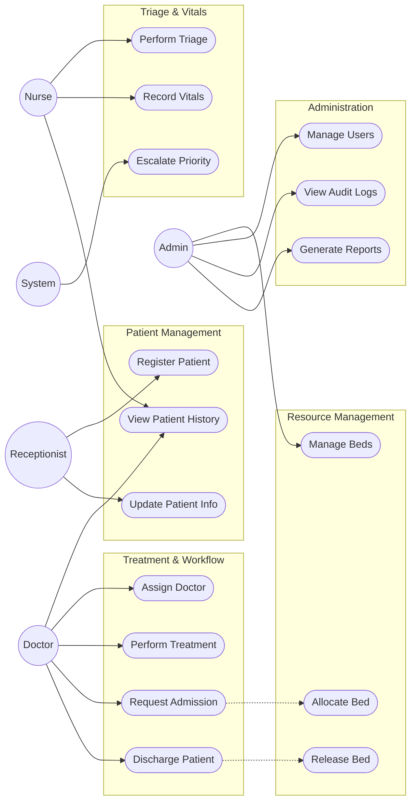

# Use Case Diagram

```mermaid
flowchart LR
    %% Actors
    Receptionist((Receptionist))
    Nurse((Nurse))
    Doctor((Doctor))
    Admin((Admin))
    System((System))

    %% Patient Management Package
    subgraph PatientManagement [Patient Management]
        UC1([Register Patient])
        UC2([Update Patient Info])
        UC3([View Patient History])
    end

    %% Triage Package
    subgraph TriageVitals [Triage & Vitals]
        UC4([Perform Triage])
        UC5([Record Vitals])
        UC6([Escalate Priority])
    end

    %% Treatment Package
    subgraph TreatmentWorkflow [Treatment & Workflow]
        UC7([Assign Doctor])
        UC8([Perform Treatment])
        UC9([Request Admission])
        UC10([Discharge Patient])
    end

    %% Resource Management Package
    subgraph ResourceManagement [Resource Management]
        UC11([Allocate Bed])
        UC12([Release Bed])
        UC13([Manage Beds])
    end

    %% Admin Package
    subgraph Administration [Administration]
        UC14([Manage Users])
        UC15([View Audit Logs])
        UC16([Generate Reports])
    end

    %% Relationships
    Receptionist --> UC1
    Receptionist --> UC2
    
    Nurse --> UC4
    Nurse --> UC5
    Nurse --> UC3
    
    Doctor --> UC3
    Doctor --> UC7
    Doctor --> UC8
    Doctor --> UC9
    Doctor --> UC10

    Admin --> UC13
    Admin --> UC14
    Admin --> UC15
    Admin --> UC16

    System --> UC6
    
    %% Includes/Extends
    UC9 -.-> UC11
    UC10 -.-> UC12
```
